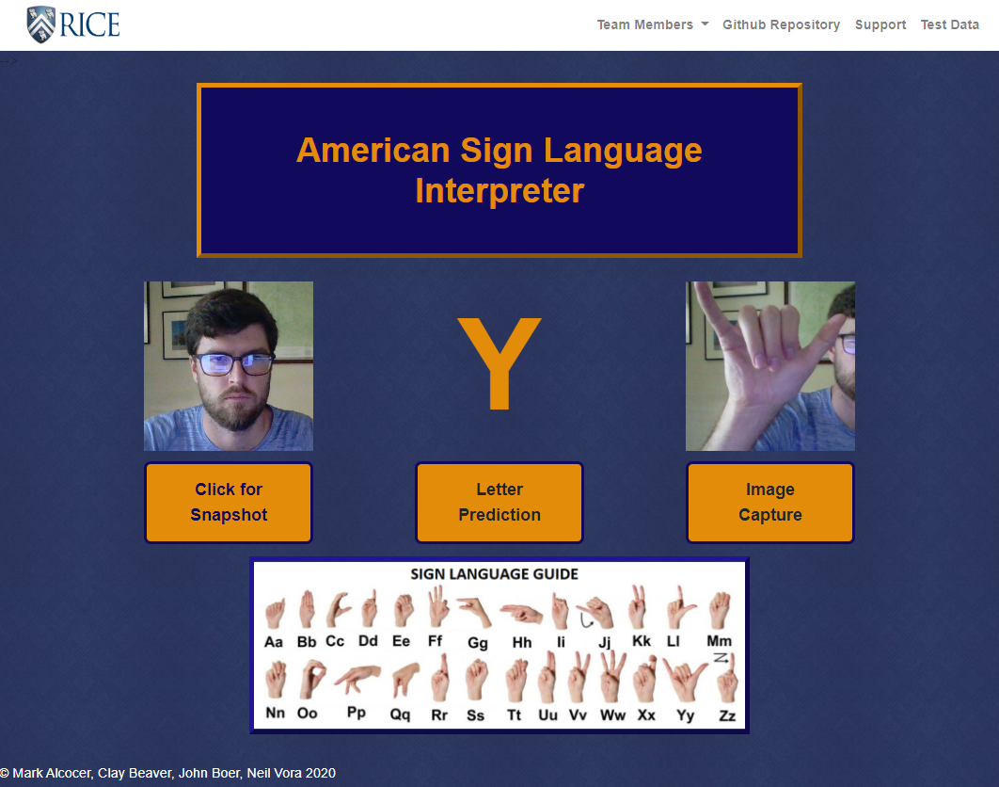

# American Sign Language Interpreter

## Clay Beaver, Neil Vora, John Boer, Mark Alcocer

### Project Outline

For our project we developed a web application to predict sign language letters using a Machine Learning model.  Our model is trained to interpret the 26 letters of the sign language alphabet.  The user will use their web camera to show a hand sign, and our model will predict which letter they are presenting.

### Link to Web Application:

https://asl-alphabet-translate.herokuapp.com/

#### Technical Skills:

*	Python
* Jupyter Notebook
* Pandas
*	Scikit-Learn
*	Tensorflow
*	Numpy
*	OpenCV / cv2
*	HTML/CSS
*	JavaScript
* Flask

#### Webpage Example:

