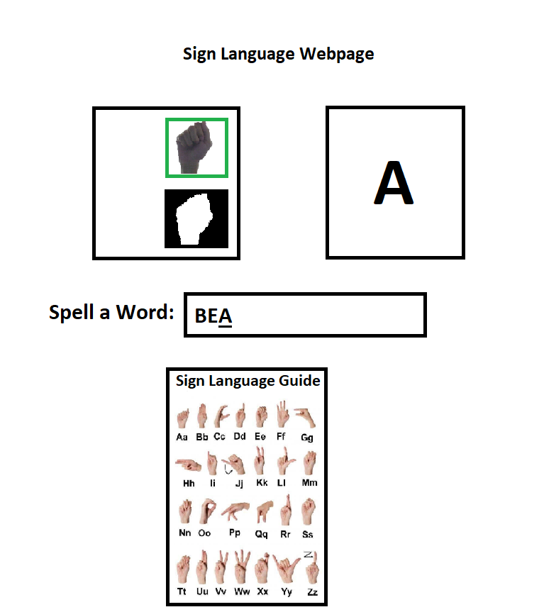

## Project Outline

### Project 3 – Team 4 (Clay, Neil, John, Mark)

Our project is to develop a web application using Machine Learning to interpret the 26 letters of the sign language alphabet.  The user will use their web camera to show a sign, and our model will predict what letter they are presenting.

We will train our model using the following database which contains 4,000+ images (~155 per letter, 4 different camera angles):

https://data.mendeley.com/datasets/jzy8zngkbg/4

### Technical Skills:

*	Python
*	Scikit-Learn
*	Tensorflow
*	Numpy
*	OpenCV / cv2
*	HTML/CSS
*	JavaScript

Bonus: Not only would we like to be able to present the Letter the user is holding up, but we would like be spell words and possibly sentences. This website can be used to help learn sign language, and we can provide tools to help teach the user how to learn the letters of the alphabet. 

### Webpage Example:

