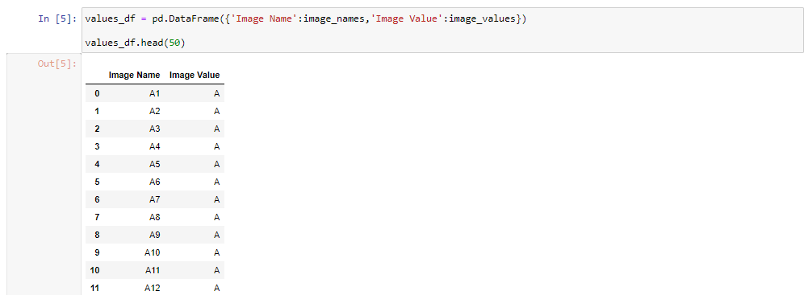
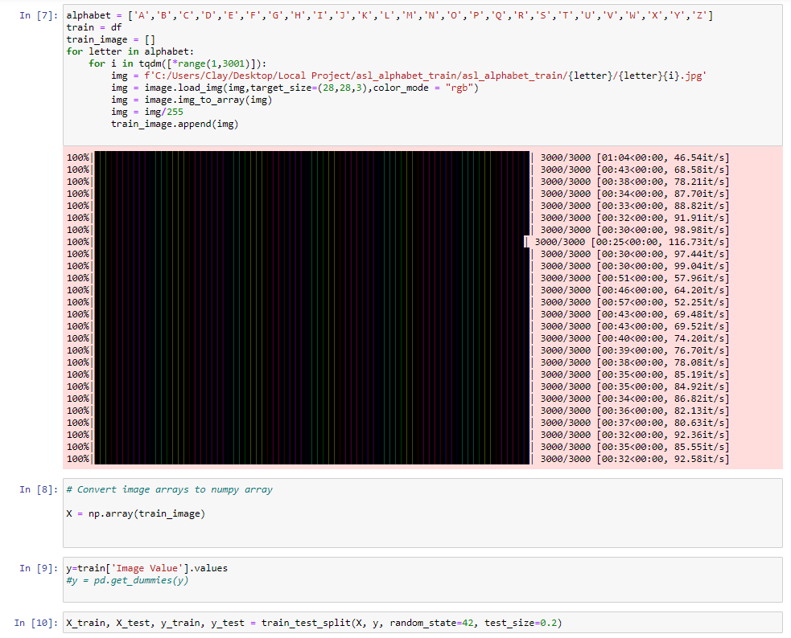

## Project Outline

### Project 3 – Team 4 (Clay, Neil, John, Mark)

Our project is to develop a web application using Machine Learning to train a model which will interpret the 26 letters of the sign language alphabet.  The user will use their web camera to show a sign, and our model will predict what letter they are presenting.

We will train our model using the following database which contains 87,000 images which are 200x200 pixels.

https://www.kaggle.com/grassknoted/asl-alphabet

### Technical Skills:

*	Python
* Jupyter Notebook
* Pandas
*	Scikit-Learn
*	Tensorflow
*	Numpy
*	OpenCV / cv2
*	HTML/CSS
*	JavaScript

Bonus: Not only would we like to be able to present the Letter the user is holding up, but we would like be spell words and possibly sentences. This website can be used to help learn sign language, and we can provide tools to help teach the user how to learn the letters of the alphabet. 

### Webpage Example:

## Jupyter Notebook / Pandas

### Create a list for the number and letter coresponding to the image names

### Dataframe 

## Train Data

### Loop of a loop that coresponds to the image names. Loop through images in folder. Preprocess Images. Append image to a list in form of array.

### Training our model

## Web Camera Recognition

### Create a python function to use webcam to capture screenshots

